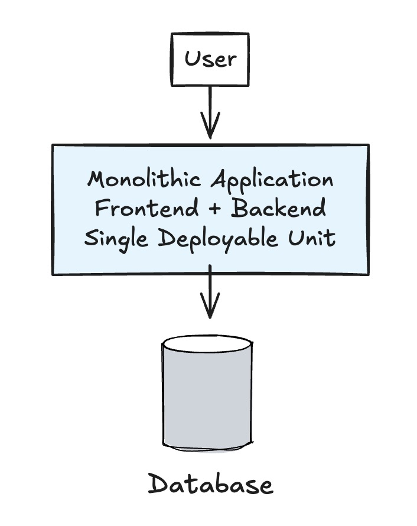

# Simple E-Learning Platform Challenge

## Detail

### Business Domain or Category

Education

### Project Description

A simple e-learning platform that provides scalable learning experiences, enabling remote education and continuous professional development with course management, user progress tracking, and interactive learning features.

### Why

Learners and educators need accessible, scalable platforms to deliver and consume educational content remotely, supporting continuous professional development and skill advancement.

### Variant

- Video-based
- Classroom
- E-book reading (Noted sharing)
- etc.

## Overall architecture

[Insert your overall architecture here]

## Possible Architecture

This is just a starting point for the architecture. You can come up with your own design.

### 1. Simple Local Architecture

## Guideline

1. User authentication and role management is possible.
2. Or you can use microservices architecture with separate services for user management, course content, and progress tracking.
